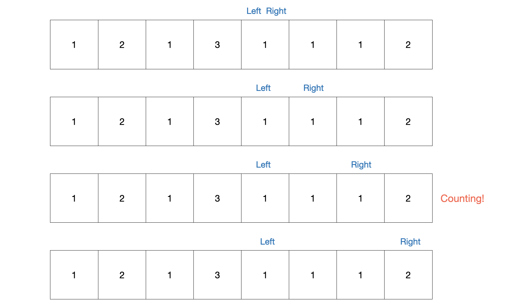

# 슬라이딩 윈도우
선형의 자료구조에서 가상의 window가 있다고 가정하고 가상의 window를 움직이며 window 안의 값을 다룬다


> 수열 [1, 2, 3, 4, 5, 6, 7]에서 크기가 3인 연속된 부분수열중 합이 10이 넘는 부분연속수열의 개수를 구하는 문제

일반적으로 반복문을 두번 돌려서 완전탐색을 진행할 수 있다

2중 반복문을 사용하는 것의 시간복잡도는 O(n^2)이다 만약 이때 슬라아당 윈도우를 사용하면 O(n)으로 시간복잡도를 줄일 수 있다

```js
const arr = [1, 2, 3, 4, 5, 6, 7]

let result = 0;
let sum = 0;
for (let i = 0; i < 3; i++) {
  sum+=arr[i];
}
if (sum > 10) { 
  result++;
}

for (let i = 3; i < arr.length; i++){
  sum = sum - arr[i - 3] + arr[i];
  if (sum > 10) { 
    result++;
  }
}
console.log(result);
```
```
// 결과
3
```

1. 초기 window를 셋팅한다 (크기에 맞춰서)
2. 인덱스의 증가함에 따라 window가 움직인다
3. **기존의 값에서 빼거나 더하는 연산을 이용해서 해당 window의 값을 구한다**
4. 조건에 따른 비교를 한다

기존의 값에서 연산을 하는 것이 중요하다


**window가 이동함에 따라 겹치는 구간이 존재하기 때문에 기존에 있던 부분은 제거하고, 새로운 부분은 추가하면 된다**

> 기존: (2+3+4) / 이동후: (3+4+5) / 겹치는 부분: (3+4) → (2+3+4)-2+5 === (9-2+5)

<br>

# 투포인트
인덱스 두개(left, right)를 사용해서 두개의 포인트를 조작해서 값을 구한다

> 수열이 주어지고, 합이 3이 되는 연속된 부분수열의 개수을 구하는 문제

```js
const arr = [1, 2, 1, 3, 1, 1, 1, 2];

let result = 0;
let sum = 0;
let left = 0;
for (let right = 0; right < arr.length; right++){
  sum += arr[right];
  while(sum > 3){
    sum -= arr[left++];
  }
  if (sum === 3){
    result++;
  }
}

console.log(result);
```
```
// 결과
5
```

for문을 통해 오른쪽 인덱스(right)가 하나씩 증가하고 내부 while문에 의해서 합이 3보다 클때 왼쪽 인덱스(left)를 3보다 작을때까지 인덱스를 증가시킨다

양 포인터(left, right) 사이 값들의 합이 3이면 카운트(result)를 하나 증가시킨다

시간복잡도 O(n)으로 효율적으로 탐색이 가능하다

<h3>포인트가 이동하는 과정</h3>





