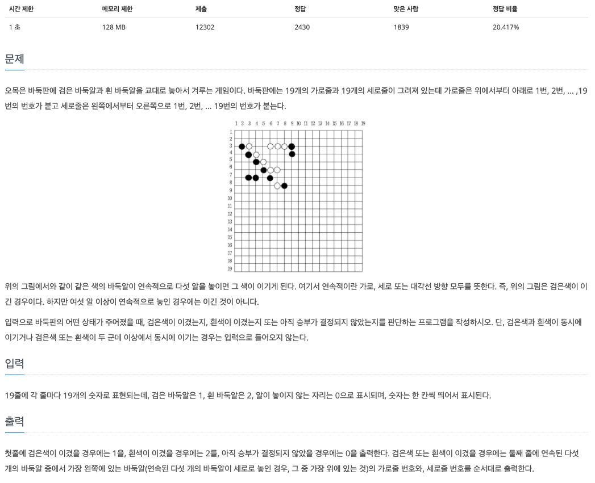
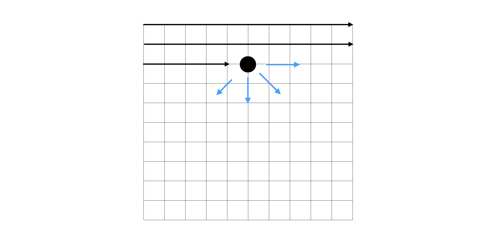

# 2차원 배열

## ▶️ 2차원 배열의 생성
2차원 배열을 생성하는 방법에는 몇가지가 있다

### 1. push
빈 배열을 선언하고 push 하는 방법
```js
const arr = new Array();
for (let i = 0; i < 4; i++){
  arr.push(Array(4).fill(0));
}
``` 

### 2. map
크기가 지정된 배열을 선언하고 `map`을 이용해서 배열로 바꿔주는 방법
```js
const arr = new Array(4).fill(null).map(() => Array(4).fill(0));
```

### 3. Array.from
`Array.from`은 첫번째 인자로 배열을 받고 두번째 인자로는 map과 동일하게 각 요소에 적용할 홤수를 인자로 입력받는다 
```js
const arr = Array.from(Array(4), () => Array(4).fill(0));
```
- `Array.from`은 얉은 복사 된 새로운 객체를 생성한다

<br>

## ▶️ 2차원 배열 문제
보통 2차원 배열의 문제는 인덱스를 다루는 문제가 주를 이룬다

### 1. 모든 경우를 다 도는 문제

> n*n 크기의 격자판에서 가로 세로의 합이 가장 큰 경우를 반환하는 문제

```js
const solve = (board) => {
  // 가로의 길이
  const len = board.length;

  // 결과를 저장할 변수
  let result = 0;

  // 각각 가로세로의 합을 저장할 임시 배열
  const tempArr = new Array(len*2).fill(0);

  // 모든 경우를 탐색한다
  for (let i = 0; i < len; i++){
    for (let j = 0; j < len; j++){
      tempArr[i] += board[i][j];
      tempArr[j+len] += board[i][j];
    }
  }
  result = Math.max(...tempArr);

  return result;
}
```

1. 각 가로 세로의 합을 저장할 임시 배열을 생성하고, 이중 for문을 이용해서 모든 경우를 탐색하며 임시 배열에 더해준다 
2. 암사 해열을 펼침 연산자(`...`)를 이용해서 가장 큰 수를 구해준다

### 2. 플러드 필(Flood Fill)
**플러드 필**이란 다차원 배열에서어떤 칸과 연결된 영역을 찾는 알고리즘이다

> 주위(상하좌우)보다 큰수의 위치를 찾는 문제

```js
const solve = (nums) => {
  const len = nums.length;
  let answer = [];
  
  // 상하좌우의 인덱스 계상을 하기 위한 배열
  const dx = [1, 0, -1, 0];
  const dy = [0, 1, 0, -1];

  // 모든 요소를 탐색
  for (let i = 0; i < len; i++){
    for(let j = 0; j < len; j++){
      flag = true;
      // 플로드 필(상하좌우를 확인한다)
      for (let k = 0; k < dx.length; k++){
        nx = i+dx[k];
        ny = j+dy[k];
        if(nx >= 0 && nx < len && ny >= 0 && ny < len){
          if(nums[i+dx[k]][j+dy[k]] >= nums[i][j]){
            flag = false;
            break;
          }
        }
      }
      if(flag === true) answer.push([i, j]);
    }
  }
  return answer;
}
```
1. 이중 for문을 이용해서 모든 요소를 탐색한다
2. 플로드 필을 이용해서 상하좌우 인덱스를 확인한다 
  - 만약 현재 인덱스가 (0, 0)이라면 배열에서 (0, -1)인덱스를 탐색할 수 없다
  - out of range!
3. 현재 요소가 상하좌우 요소보다 크면 결과배열(answer)에 push 한다


### 3. 플러드 필을 응용한 문제 (백준 - 오목)

> 백돌과 흑돌중 이긴 사람을 출력하는 문제  
<br>
[백준 2615 - 오목문제](https://www.acmicpc.net/problem/2615)



#### 접근방향
플로드 필을 이용해서 한 방향으로 진행하며 카운팅이 5가 되거나, 다른 돌 또는 공백이 있으면 `break`한다



for문을 통해 위에서부터 순차적으로 탐색이 진행되므로 4가지 방향만 탐색하면 된다 (반대 방향으로 진행해도 같다) 

```js
const fs = require("fs");
const filePath = process.platform === 'linux' ? '/dev/stdin' : './2615.txt';

let board = fs.readFileSync(filePath).toString().trim().split("\n");
board = board.map(item => item.split(" ").map(item2 => +item2));

const solve = (board) => {
  const len = board.length;
  
  // →, ↘︎, ↓, ↙︎ 방향으로 진행하기 위한 배열
  const dx = [0, 1, 1, 1];
  const dy = [1, 1, 0, -1];

  for(let i = 0; i < len; i++){
    for(let j = 0; j < len; j++){
      if(board[i][j] !== 0){
        // 현재 돌(1 or 2)을 저장하기 위한 변수
        temp = board[i][j];
        for(let k = 0; k < dx.length; k++){
          x = i;
          y = j;
          nx = i + dx[k];
          ny = j + dy[k];
          cnt = 1;
          
          while(true){
            // 만약 다음 인덱스가 범위를 벗어나면 break
            if(nx < 0 || nx >= len || ny < 0 || ny >= len) break;
            // 다음 돌이 다른 돌이라면 break
            if(board[nx][ny] !== temp) break;
            nx += dx[k];
            ny += dy[k];
            cnt++;

            if(cnt === 5){
              // 진행방향의 반대편이 같은 돌이라면 break (6개 이상이 되는 경우)
              if(x-dx[k] >= 0 && x-dx[k] <= len-1 && y-dy[k] >= 0 && y-dy[k] <= len-1){
                if(board[x-dx[k]][y-dy[k]] === temp) break;
              }
              // 다음돌이 같은 돌이라면 break (6개 이상이 되는 경우)
              if(nx >= 0 && nx < len && ny >= 0 && ny < len) {
                if(board[nx][ny] === temp) break;
              }
              // 이긴사람 (temp)
              console.log(temp);
              // 오른쪽 하단으로 진행하는 경우 가장 왼쪽돌을 출력
              if(k === 3) console.log(i+5, j-3);
              else console.log(i+1, j+1);
              return;
            }
          }
        }
      }
    }
  }
  console.log(0);
  return;
}

solve(board);
```

1. 이중 for문을 사용해서 전체의 경우를 탐색
2. 0이 아닌 흰돌 또는 검은 돌을 만났을 때 4가지 경우를 확인(플러드 필)
3. 각각의 방향을 확인하면서 돌이 6개 이상이 되는 경우를 제거 (인덱스를 이용)
4. 위 과정을 반복하면서 오목이 완성된 곳의 인덱스와 승자를 `console.log()`로 출력

