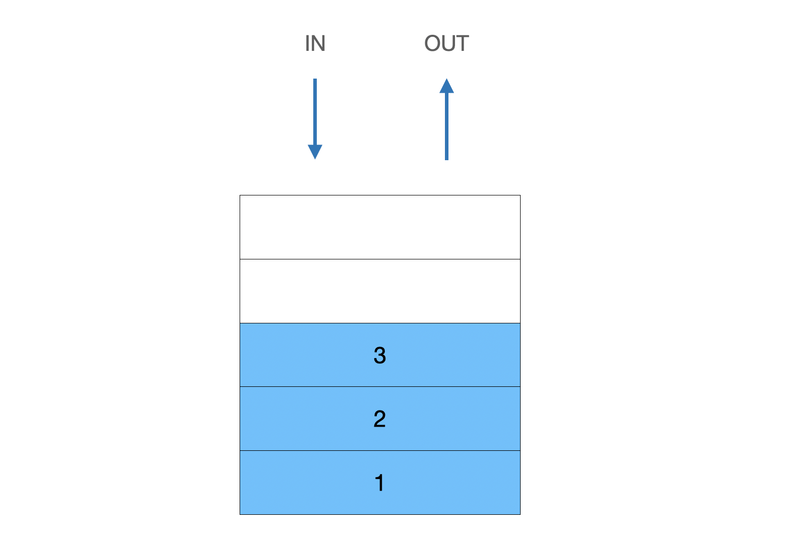

# 스텍 (stack)
스텍은 한쪽에서만 push, pop (데이터 I/O)을 할 수 있는 선형 자료구조이다 
- **LIFO** (Last In First Out)



> **tip!**  
`()`,`{}`,`[]`가 등장하면 스텍을 활용하는 것을 고려해보자(70%~80%)


## 후위 연산

### 참고) 트리순회

1. 전위 순회: 부모 → 왼쪽자식 → 오른쪽자식
2. 중위 순회: 왼쪽자식 → 부모 → 오른쪽자식
3. 후위 순회: 왼쪽자식 → 오른쪽자식 → 부모

<br>

후위연산을 하는데 스텍을 이용할 수 있다
```js
const solve = (s) => {
  const stack = [];
  for(const item of s){
    if(item === "+"){
      temp1 = stack.pop();
      temp2 = stack.pop();
      stack.push(temp2 + temp1);
    } else if(item === "-"){
      temp1 = stack.pop();
      temp2 = stack.pop();
      stack.push(temp2 - temp1);
    } else if(item === "*"){
      temp1 = stack.pop();
      temp2 = stack.pop();
      stack.push(temp2 * temp1);
    } else if(item === "/"){
      temp1 = stack.pop();
      temp2 = stack.pop();
      stack.push(temp2 / temp1);
    }else stack.push(parseInt(item));
  }
  return stack.pop();
}
console.log(solve("25+3*21+*"));
```
```
// 중위표현
(2 + 5) * 3 * (2 + 1)

// 결과
63
```

1. 스텍(배열)을 생성해서 숫자는 순서대로 스텍에 넣어준다 
2. 연산자를 만난 경우 연산자를 가운데에 스텍에서 먼저 뺀 숫자를 뒤로, 늦게 뺀 숫자는 앞으로 배치하여 계산한다
3. 계산한 결과를 스텍에 다시 넣어준다

## 백준2493 - 탑


> 간단하게 말해서 현재의 위치에서 바로 왼쪽의탑중에 자신보다 큰 탑의 인덱스를 출력해주면 된다

```js
const fs = require("fs");
const filePath = process.platform === 'linux' ? '/dev/stdin' : './2493.txt';

let input = fs.readFileSync(filePath).toString().trim().split("\n");
n = parseInt(input.shift());
input = input[0].split(" ").map(item => +item);

const solve = (nums, n) => {
  const result = new Array(nums.length).fill(0);
  const stack = [];

  for (let i = n; i >= 0; i--){
    while (stack.length > 0 && nums[stack[stack.length-1]] < nums[i]){
      result[stack.pop()] = i+1;
    }
    stack.push(i);
  }
  return result.join(" ");
}

console.log(solve(input, n));
```
```
// 결과
0 0 2 2 4
```

1. 먼저 자신보다 더 작은 탑이 없는 경우를 고려해서 `result`를 0으로 초기화해준다
2. 스텍역할을 하는 배열을 하나 선언한다
3. for문을 이용해서 뒤에서부터 반복한다
4. 만약 스텍이 비어있고, 스텍의 인덱스를 가진 값이 for문의 i값을 인덱스로 하는 값보다 작으면(비교 - `while`이용), 스텍의 가장 윗 인덱스를 제거하고 결과값에 떨어진 정도(i+1)을 저장한다 / 스텍에 값을 넣어준다

결과값을 출력하게 되면 자신보다 큰 탑의 인덱스를 저장하게 된다

<br>

# 큐 (Queue)
큐는 스텍과 다르게 처음 양쪽에 하나씩 삽입(In), 삭제(Out)이 가능한 선형 자료구조이다
- **FIFO** (First In First Out)
- In, Out이 같은 방향에 있지 않는다


## 선행되어야 하는 항목

만약 스킬트리를 선택할 때 선행되어야 하는 스킬이 있다고 했을때 잘못된 스킬트리를 작성했을때는 `NO`를 정상적인 스킬트리라면 `YES`를 출력하는 문제
```js
const solve = (skill, skill_trees) => {
  const queue = skill.split("");
  for(const s of skill_trees){
    if(queue.includes(s)){
      if(queue[0] === s) queue.shift();
      else return "NO";
    }
  }
  if(queue.length === 0) return "YES";
  return "NO";

}
console.log(solve("ABC", "ABDCGE"));
```
```
// 결과 
YES
```

1. 먼저 정해진(선행되어야하는) 스킬을 큐 역할을 하는 배열로 변환시켜준다
2. for문을 이용해서 작성한 스킬트리를 순회한다
3. 작성한 스킬트리를 하나하나 순서대로 순회하면서 만약 선행스킬에 현재 스킬이 존재하고, 큐의 제일 앞에 위치한 스킬과 현재 스킬이 동일하다면 큐의 제일 앞항목을 제거하고 다시 진행한다(일치하지 않으면 `return "NO"`)
4. 끝까지 다 진행했음에도 NO를 리턴하지 않았다면 YES를 리턴한다

<br>

# 데크 (Deque)
큐와 비슷하지만 양쪽으로 삽입(In), 삭제(Out)이 가능한 선형 자료구조이다
- 스텍과 큐의 장점을 가지고 만든 구조


