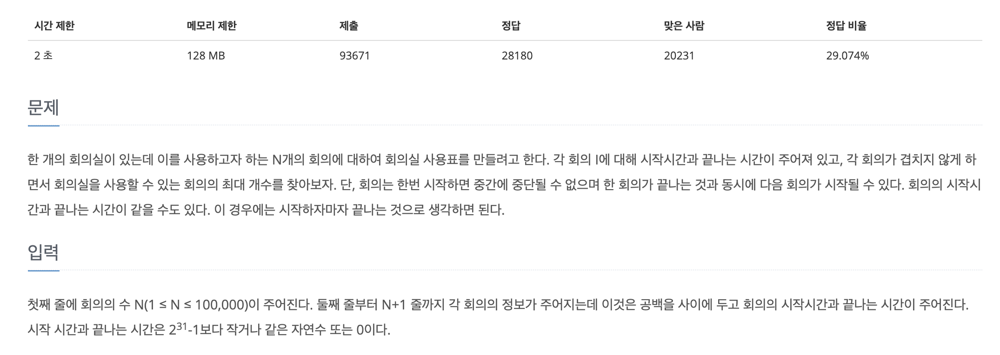
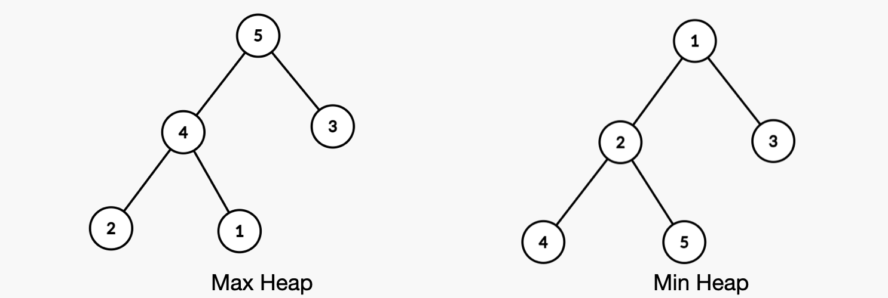

# ▶️ 그리디 알고리즘 (Greedy Algorithm)

탐욕적인 알고리즘이라는 뜻으로 **현재 상황에서 <u>가장 좋은 경우</u>를 선택**한다 

현재 상황에서 가장 좋은 해를 결정하고 다음 단계로 넘어가기 때문에 일부 상황에서는 나쁜 해가 될 수 있다

> 그리디 알고리즘이 적용될 수 있는 경우  
1. 이전의 선택이 이후의 선택에 영향을 주지 않아야 한다.
2. 각 부분 문제에 대한 최적해가 문제의 최적해를 얻을 수 있다.


## ▷ 회의실 문제 (beakjoon - 1931)


- 입력값
```
11
1 4
3 5
0 6
5 7
3 8
5 9
6 10
8 11
8 12
2 13
12 14
```

> 회의시간이 겹치지 않고, 제일 많은 회의를 할 수 있는 회의의 개수를 구하면 된다

```js
const fs = require("fs");
const filePath = process.platform === 'linux'? "/dev/stdin" : "./2_1931.txt";

let input = fs.readFileSync(filePath).toString().trim().split("\n");

const n = input.shift()[0];

for (let i = 0; i < n; i++) {
  input[i] = input[i].split(" ").map(item => +item)
}

// 시작시간이 더 큰수가 기준이 되면 안되기 때문에 시작시간을 기준으로 정렬, 끝나는 시간을 기준으로 정렬 (총 두번 정렬)
input.sort((a, b) => a[0] - b[0]);
input.sort((a, b) => a[1] - b[1]);

// 첫번째 회의는 무조건 시작하기 때문에 result = 1
let result = 1;
// 끝나는 시간
let temp = input[0][1];
for (let i = 1; i < n; i++) {
  if (input[i][0] >= temp) {
    result += 1;
    temp = input[i][1];
  }
}
console.log(result);
```
그리디 알고리즘은 보통 최솟값, 최댓값을 찾는 문제가 많으므로 정렬을 사용한다 위에서는 시작시간으로 한번 정렬해주고, 끝나는 시간을 오름차순으로 정렬해준다

정렬된 회의의 시작시간과 끝나는 시간을 가지고 반복문을 통해 처음 위치한 값을 기준으로 **끝나는시간과 시작시간을 비교해서 카운팅**한다

<br>

# ▶️ 우선순위 큐 (Priority Queue)

들어간(In) 순서와 상관없이 우선순위가 높은 데이터가 먼저 나온다(Out)

<u>힙 탐색의 시간복잡도는 O(logN)이다</u>

우선순위 큐는 힙(Heap)을 이용해서 구현할 수 있다 

## ▷ 힙(Heap)
힙(Heap)은 최대값 또는 최솟값을 빠르게 찾아내기 위해 고안된 자료구조로 완전 이진 트리의 구로를 가진다

> **완전 이진 트리**  
leaf노드를 제외한 나머지 모든 부모 노드들이 자식 노드를 두개씩가지고 있는 이진트리

힙은 두가지 종류를 가진다



1. **최대 힙(Max Heap)**: 루트노드로 올라갈수록 값이 커지는 완전 이진 트리(힙)
  - 부모노드가 자식노드보다 무조건 크다
2. **최소 힙(Min Heap)**: 루트노드로 올라갈수록 값이 작아지는 완전 이진 트리(힙)
  - 부모노드가 자식노드보다 무조건 작다

### 1. 삽입연산(push)
1. 삽입연산(push)을 하게되면 left노드에 개수를 고려하면서(한 노드에 자식노드 2개) 삽입이된다
2. 삽입된 노드는 부모노드와 값을 비교한다 (크거나 작거나)
3. 만약 최대힙에서 자식노드가 부모노드의 값보다 크다면, 부모노드와 자식노드를 교체해준다
4. 교체해주는 과정을 더이상 그렇지 않을때까지, 루트노드에 도착했을때까지 반복한다

### 2. 삭제연산(pop)
1. 우선순위큐에서의 삭제는 가장 높은 우선순위를 가진 루트노드가 삭제가 된다
2. 이후 제일 마지막에 있는 노드를 루트노드의 자리로 옮긴다
3. 이후 자식노드들과 비교하면서 자리를 교체한다

## ▷ 최대 힙(Max Heap) 구현

> \* 인덱스
1. 왼쪽 자식 노드 인덱스 → 부모 노드 인덱스 * 2 + 1  
2. 오른쪽 자식 노드 인덱스 → 부모 노드 인덱스 * 2 + 2  
3. 부모 노드 인덱스 → (자식 노드 인덱스 - 1) / 2 → `parseInt()`를 사용

```js
class MaxHeap{
  constructor() {
    this.heap = [];
    this.heap.push(1e9);    // 큰 값을 제일 앞에 넣어준다
  }

  // heap에 데이터를 삽입
  insert(value){
    this.heap.push(value);
    // 값이 들어오면 작거나 큼에 따라 위로 올려준다
    this.upheap(this.heap.length - 1);
  }


  // insert된 값을 올려주는 메소드
  upheap(pos){
    // 마지막으로 들어온 값을 temp에 할당
    let temp = this.heap[pos];

    // 부모노드와 비교하며 현시점의 부모보다 크면 부모노드의 값을 아래로 내림
    while(temp > this.heap[parseInt(pos/2)]){
      this.heap[pos] = this.heap[parseInt(pos/2)];
      pos = parseInt(pos/2);
    }
    // 마지막으로 현시점의 노드에 temp값을 넣어준다
    this.heap[pos] = temp;
  }


  // 루트노드를 가져오는 메소드
  get(){
    // 만약 heap의 크기가 0인데 pop을 하려고 하면 false반환
    if (this.size() === 0) return false;
    // 만약 heap의 크기가 1이라면 downheap()을 하지않고 pop만 수행
    if (this.size() === 1) return this.heap.pop();
    // 루트노드값을 result 변수에 임시저장하고, 루트노드 자리에 제일 마지막 노드를 위치시킨다
    const result = this.heap[1];
    this.heap[1] = this.heap.pop();
    // 아래로 진행하면서 자리배치
    this.downheap(1, this.heap.length-1);
    return result;
  }

  downheap(pos, len){
    // 루트노드에 위치한 값을 임시 저장
    let temp = this.heap[pos], child;
    while(pos <= parseInt(len/2)){
      child = pos * 2;        // 왼쪽 자식
      // 자식노드가 하나만 존재할 수 있기 때문에 child < len
      if(child < len && this.heap[child] < this.heap[child+1]) child++;      // +1로 오른쪽자식과 비교한다 
      // 자식노드보다 크다면 멈춘다
      if(temp >= this.heap[child]) break;
      // 자식노드와 부모노드의 자리를 교환
      this.heap[pos] = this.heap[child];
      // 인덱스를 아래로 옮김
      pos = child;
    }
    // 현재 시점의 노드에 값 할당
    this.heap[pos] = temp;
  }

  
  // heap의 크기를 반환하는 메서드
  size(){
    return this.heap.length-1;
  }
}
```
1. `insert()`: heap에 데이터를 삽입
2. `upheap()`: `insert()`내에 존재하면서 데이터가 삽입이되면 정렬시켜줌
3. `get()`: heap의 루트노드를 반환
4. `downheap()`: `get()`에 존재하면서 루트노드가 삭제되면 정렬하면서 채워줌
5. `size()`: heap의 크기를 반환


