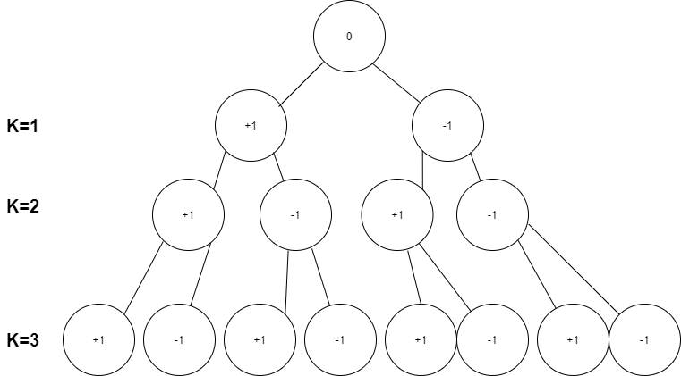

# 문제

[타겟 넘버](https://programmers.co.kr/learn/courses/30/lessons/43165) 

## 문제설명

n개의 음이 아닌 정수가 있습니다. 이 수를 적절히 더하거나 빼서 타겟 넘버를 만들려고 합니다. 예를 들어 [1, 1, 1, 1, 1]로 숫자 3을 만들려면 다음 다섯 방법을 쓸 수 있습니다.

-1+1+1+1+1 = 3
+1-1+1+1+1 = 3
+1+1-1+1+1 = 3
+1+1+1-1+1 = 3
+1+1+1+1-1 = 3

사용할 수 있는 숫자가 담긴 배열 numbers, 타겟 넘버 target이 매개변수로 주어질 때 숫자를 적절히 더하고 빼서 타겟 넘버를 만드는 방법의 수를 return 하도록 solution 함수를 작성해주세요.

## 제한 조건

* 주어지는 숫자의 개수는 2개 이상 20개 이하입니다.
* 각 숫자는 1 이상 50 이하인 자연수입니다.
* 타겟 넘버는 1 이상 1000 이하인 자연수입니다.


## 입출력 예시


|numbers|target|output|
|------|------|------|
|[1, 1, 1, 1, 1]|3|5|


# 작성 코드 





```javascript

function solution(numbers, target){
    let answer = 0; 
    let arr = Array(numbers.length+1).fill(0);
    // 0을 루트로 사용하여 인덱스 번호를 직관적으로 매핑 
    for(let i = 1; i <= numbers.length; i++) arr[i] = numbers[i-1];
    function DFS(k, sum){
        // 1. 인덱스 2. 누적값   
        if(k === numbers.length) {
            // target을 만족할 때 answer ++
            if(sum === target) answer += 1;
        }
        else{
            // 부모 노드를 기준으로 두 가지 서브 트리로 나뉘어짐
            // 왼쪽 서브트리: + 
            // 오른쪽 서브트리: - 
            DFS(k+1, sum + arr[k+1]);
            DFS(k+1, sum - arr[k+1]);
        }
    }
    DFS(0, 0);
    return answer; 
}


```


