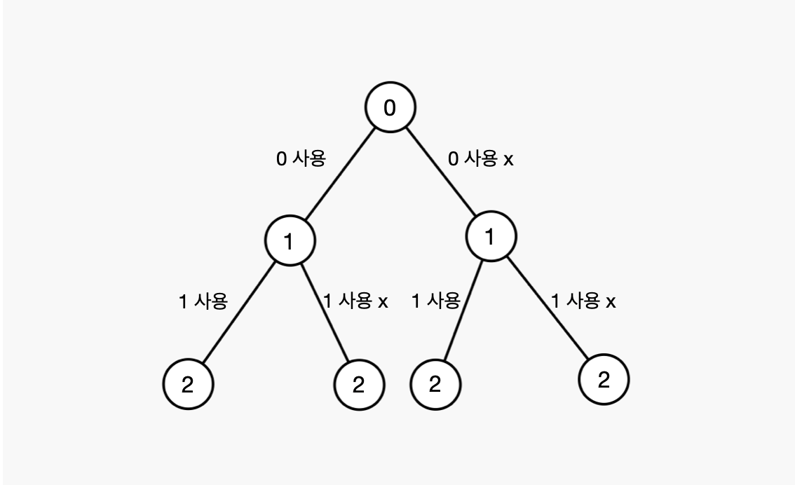
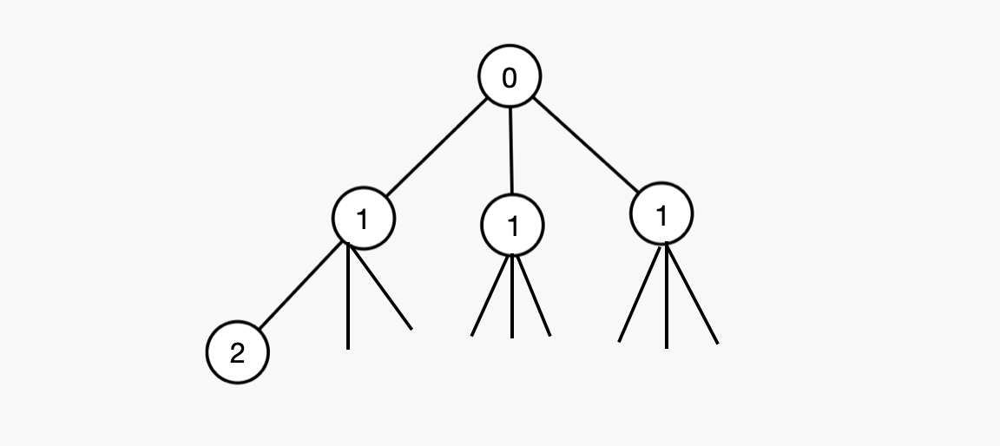

# ▶️ DFS (깊이 우선 탐색)
DFS는 깊이 우선 탐색으로 재귀함수를 이용해서 가지처럼 뻣어나가는 알고리즘이다

DFS를 사용하기 편한 방법으로는 다음과 같은 형태를 이용하면 좋다
```js
const DFS = () => {
  if(조건){
    내용(조건이 맞아 결과에 추가하는)
  }else{
    내용(재귀호출)
  }
}
```

## ▷ 부분집합문제
두가지로 분류한다 (해당 숫자를 **사용하거나, 사용하지 않거나**)



```js
const result = [];
const temp = [];
function DFS(v){    // v는 인덱스
  if(v > n) {   // n까지의 원소
    result.push(temp.slice())   // 복사해서 저장
    return;
  }
  else{
    temp.push(v);   
    DFS(v+1);
    temp.pop();
    DFS(v+1);
  }
}
DFS(1);
```

1. DFS 함수내 `if`문에서 조건을 넣어주고 충족한다면 결과값에 저장한다(위의 n은 예시)
2. `else`문에서는 temp라는 배열에 `push`를 해주게 되는데 이때는 해당 값을 사용한다는 뜻이고 그 아래 `pop`은 넣어줬던 값을 뺌으로서 사용하지 않겠다는 뜻이다 (사용했을때 재귀호출, 사용하지 않을때 재귀호출)


## ▷ 중복순열
중복순열 문제는 부분집합과 다르게 **중복**을 허용하므로써 가지가 두개만 나올 수 없다

> 예시) 1,2,3의 중복 수열



수열의 길이만큼(예시에서 3개이므로 가지도 3개씩) 가지가 생성된다 따라서 <u>재귀 호출도 3번!</u>

```js
const answer = [];
let temp = [];

const DFS = (L) => {
  if(L === 수열개수){
    answer.push(temp.slice());
  }else {
    for(let i = 1; i <= arr.length; i++){
      temp.push(i);
      dfs(L + 1)
      temp.pop();
    }
}
```
DFS의 인자인 L은 level을 뜻하는 것으로 깊이를 나타낸다

1. `if`문에서는 조건에 맞으면 결과를 저장해준다
2. `else`문에서는 `for`문을 사용해서 배열의 길이만큼 반복해준다

## ▷ 중복이 없는 순열
중복수열을 사용할때와 다른 점이 한가지 있다면 사용여부를 확인하는 **체크배열**을 생성해서 검사를 해준다
```js
let answer = [];
const len = nums.length;
const check = new Array(len).fill(0);   // 체크배열

let temp = [];
const dfs = (L) => {
  if(L === m){
    answer.push(temp.slice());
  }else{
    for(let i = 0; i < len; i++){
      // check(같은 수가 있는지 확인)
      if(check[i] === 0){
        check[i] = 1;         // 수를 사용하면 체크
        temp.push(nums[i]);
        dfs(L + 1);
        check[i] = 0;         // 사용한 후 pop과 함께 체크해제
        temp.pop();
      }
    }
  }
}
dfs(0);
```

## ▷ Memoization (메모이제이션)
계산한 값을 저장해둠으로서 불필요한 같은 계산을 하지 않도록하기 위해 사용한다

피보나치 수열을 예시로 들자면 다음과 같다

```js
// 계산 값을 저장할 배열
const dy = new Array(n+1);

const fibo = (n) => {
  if(n < 2) return n;

  // 저장한 값이 있으면 저장값을 사용
  if(dy[n] !== undefined) return dy[n];

  // 저장값이 없으면 계산하고 배열에 저장
  return dy[n] = fibo(n-1) + fibo(n-2)
}
return fibo(n);
```

fibo(10)은 fibo(9) + <u>fibo(8)</u>이다 또 fibo(9)는 <u>fibo(8)</u> + fibo(7)이 된다 

이때 fibo(8)이 겹치게 되는데 메모이제이션을 사용하지 않는다면 계산을 두번 반복하게 된다 이는 아래로 내려갈수록 더욱 잦아지게 된다 따라서 속도가 느려질 수 있는데 이를 개선하기 위해 **메모이제이션을 사용하면 배열에 값이 있는지를 확인하고 있다면 그 수를 사용해 불필요한 계산을 방지할 수 있다**

## ▷ 참고 - 함수와 스텍
함수가 호출이 되면 내부적으로 스텍에 함수가 들어가게 된다 이때 스텍프레임이라고 하며 이 스텍 프레임 각각에는 함수의 정보가 담긴다

1. 매개변수
2. 지역변수
3. 복귀주소

재귀함수는 전역변수를 다루지 않는다 → 지역변수를 사용해서 문제를 해결하자!