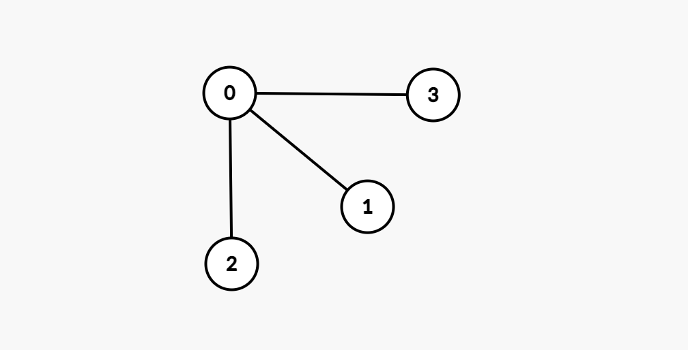
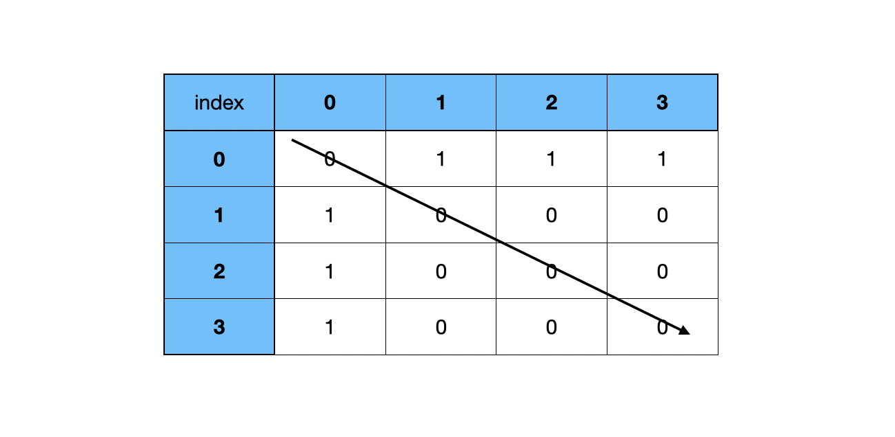
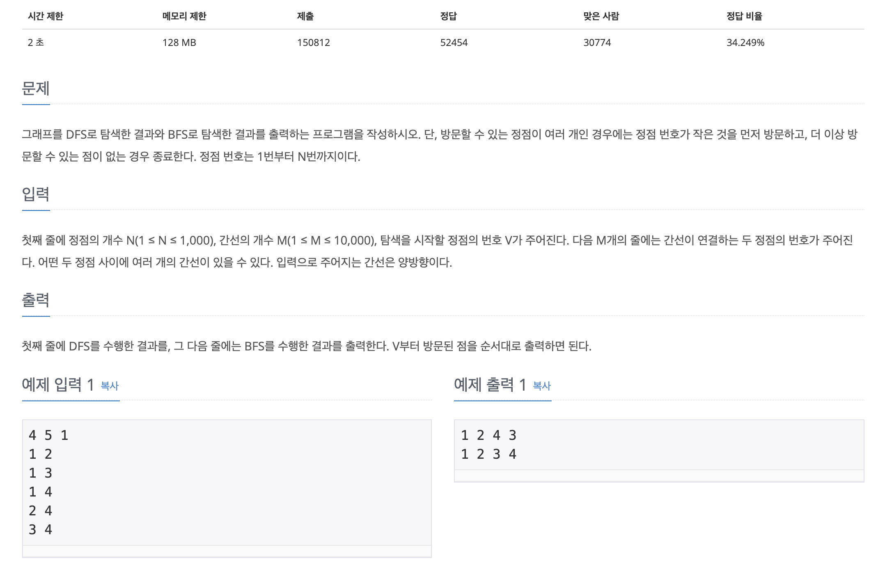

## ▶️ DFS (Bepth-First Search)
DFS알고리즘이란 **깊이 우선 알고리즘**으로 **그래프탐색에** 많이 이용된다.

## ▶️ BFS (Breadth-First Search)
BFS는 너비 우선 탐색이다 BFS인 깊이 우선 탐색과는 다르게 한쪽 노드를 깊이 탐색하는 것이 아닌 넓게 탐색한다
- 재귀적으로 구현할 수 없다
- FIFO(선입선출)을 원칙으로 하는 큐를 이용해서 구현한다
- DFS와 마찬가지로 탐색한 노드를 확실하게 구별해야 한다

## ▶️ 그래프탐색
그래프안에 어떤 값이 있는지를 확인할 수 있다 하나의 정점에서 시작해서 차례대로 모든 정점을 방문한다

- 그래프: 자료구조의 일종으로, 정점(노드)과 간선(관계)의 집합
- 차수: 정점과 연결되어 있는 간선의 개수
- 정점: 노드(아래 사진의 동그라미) - 프로그래밍에서변수로 표현
- 간선: 정점을 연결해줌(관계, 선) - 어디에 연결되어있는지 저장(배열 등 자료구조)

## ▶️ 그래프 종류
그래프는 방향성과 연결정도에 따라 구분할 수 있다
1. **무방향 그래프**: 방향성이 없는 그래프이다
2. **방향 그래프**: 진행할 수 있는 방향이 존재하는 그래프이다
3. **완전 그래프**: 각각의 정점에서 진행할 수 있는 모든 정점으로 연결된 그래프이다
4. **부분 그래프**: 원래의 그래프에서 일부 정점이나 간선을 제거한 그래프이다
5. **가중 그래프**: 간선에 가중치가 존재하는 그래프이다

## ▶️ 인접행렬, 인접리스트
DFS에서 이용할 수 있도록 형태를 변화시켜주는 것이 좋은데 인접행렬과 인접리스트 형태로 변화시킬 수 있다



### 1. **인접행렬**: 그래프의 연결관계를 행렬로 나타낸것 (노드의 번호와 대응한다)

```
[
  [0, 1, 1, 1],
  [1, 0, 0, 0],
  [1, 0, 0, 0],
  [1, 0, 0, 0],
]
```

```
(a, b)가 주어졌을때   ->   graph[a][b] = 1
```
만약 양방양인 경우 `graph[a][b] = 1`, `graph[b][a] = 1`로 둘다 표현해준다

방향이 없는 그래프이기 때문에 대각선을 기준으로 대칭이 된다

각각 노드(index)를 기준으로 연결되어 있는 값을 1로 표현한다

쉽게 구현할 수 있지만 노드의 수가 많아질수록 메모리를 많이 사용한다는 단점이 존재한다

### 2. **인접리스트**: 그래프의 연결관계를 벡터의 배열로 나타낸다
```
[
  [1, 2, 3],
  [0],
  [0],
  [0]
]
```
```
{
  "0": [1, 2, 3],
  "1": [0],
  "2": [0],
  "3": [0]
}
```

## ▷ 간단한 DFS, BFS 응용 문제

[ 백준 - 1260 ](https://www.acmicpc.net/problem/1260)



연결된 노드가 주어지고, DFS와 BFS로 구현하는 문제이다


<h3>통과한 코드</h3>
- 빙문한 노드와 방문하지 않은 노드를 구분하여 배열에 저장하는 방식

```js
const fs = require("fs");
const filePath = process.platform === 'linux' ? '/dev/stdin' : './1_1260.txt';

let input = fs.readFileSync(filePath).toString().trim().split("\n");

for (let i = 0; i < input.length; i++) {
  input[i] = input[i].split(" ").map(item => +item);
}
const n = input[0][0];
const m = input[0][1];
const v = input[0][2];
input.shift();

const graph = {};
for (let i = 0; i < input.length; i++) {
  for (let j = 0; j < 2; j++){
    if(graph[input[i][j]] === undefined){
      graph[input[i][j]] = j === 0 ? [input[i][1]] : [input[i][0]]
    } else if (graph[input[i][0]].indexOf(input[i][1]) === -1){
      graph[input[i][0]].push(input[i][1])
    } else if (graph[input[i][1]].indexOf(input[i][0]) === -1){
      graph[input[i][1]].push(input[i][0])
    }
  }
}

const dfs = (graph, v) => {
  let visit = [];
  let notVisit = [];

  notVisit.push(v);
  while(notVisit.length > 0) {
    const temp = notVisit.pop();
    if(visit.indexOf(temp) === -1){
      visit.push(temp)
      if (graph[temp] !== undefined){
        notVisit = [...notVisit, ...(graph[temp].sort((a, b) => {return b-a}))];
      }
    }
  }
  console.log(visit.join(" "))
}

const bfs = (graph, v) => {
  let visit = [];
  let notVisit = [];
  
  notVisit.push(v);
  while(notVisit.length > 0) {
    const temp = notVisit.shift();
    if(visit.indexOf(temp) === -1){
      visit.push(temp)
      if (graph[temp] !== undefined){
        notVisit = [...notVisit, ...(graph[temp].sort((a, b) => {return a-b}))];
      }
    }
  }
  console.log(visit.join(" "))
}

dfs(graph, v)
bfs(graph, v)
```

<h3>다른 방식</h3>
- 재귀를 통한 DFS, 하나의 queue를 이용한 BFS
- 그러나 백준에서는 시간초과 (테스트케이스는 정상통과)

```js
const checkDFS = new Array(1001).fill(0);

checkDFS[v] = 1;
let flag = false;
const temp = [v];
let resultDFS;

const dfs = (L, v) => {
  if(flag) return;
  if(L === n){
    flag = true;
    resultDFS = temp.join(" ");
  }
  else{
    for(let i = 0; i < graph[v].length; i++){
      if(checkDFS[graph[v][i]] === 0){
        temp.push(graph[v][i])
        checkDFS[graph[v][i]] = 1;
        dfs(L+1, graph[v][i]);
        temp.pop();
        checkDFS[graph[v][i]] = 0;
      }
    }
  }
}
dfs(1, v);
console.log(resultDFS);

const checkBFS = new Array(1001).fill(0);
const queue = [];
const bfs = (v) => {
  queue.push(v);
  checkBFS[v] = 1
  let L = 0;
  const result = [];

  while(queue.length > 0) {
    let len = queue.length;
    for(let i = 0; i < len; i++){
      let x = queue.shift();
      result.push(x);
      if(result.length === n){
        return result.join(" ");
      }
      for(let j = 0; j < graph[x].length; j++){
        if(checkBFS[graph[x][j]] === 0){
          queue.push(graph[x][j]);
          checkBFS[graph[x][j]] = 1;
        }
      }
    }
    L++;
  }
}
console.log(bfs(v))
```
