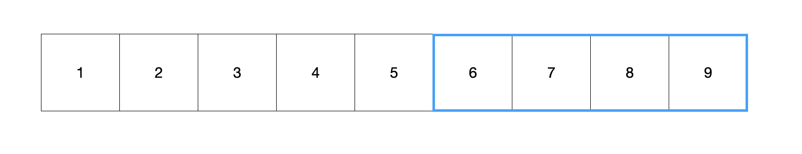
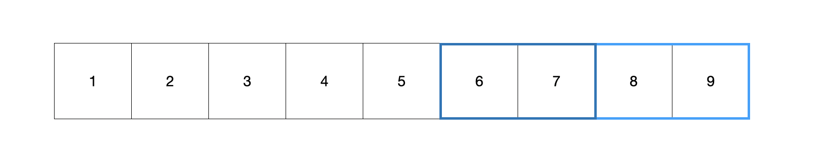
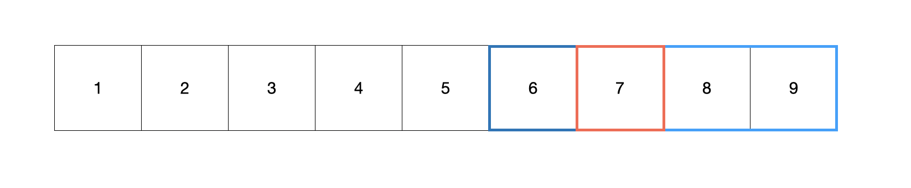
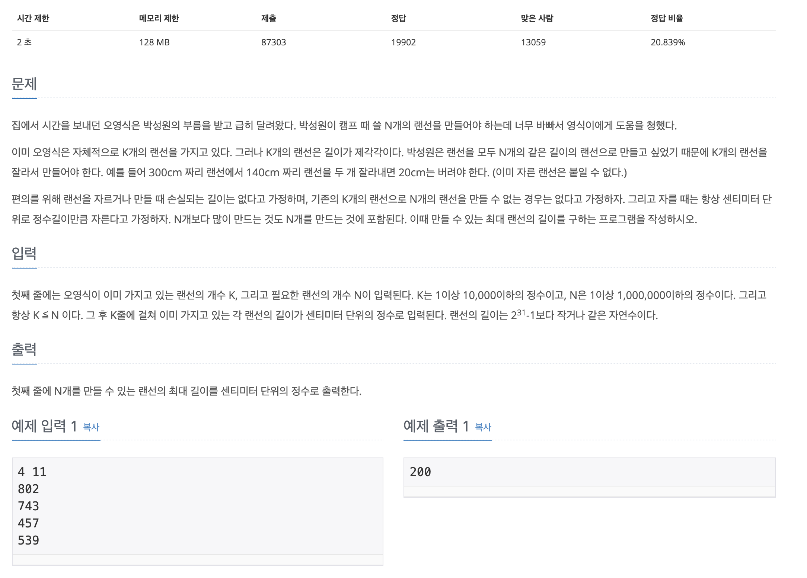

# 이분 탐색 (Binary Search)

이분 탐색 알고리즘은 탐색해야할 대상을 절반으로 계속 나눠주기 때문에 일반적으로 전체를 탐색하는 것에 비해 O(logN)의 시간복잡도를 가진다

만약 [1, 2, 3, 4, 5, 6, 7, 8, 9]라는 수열이 있을때 7을 찾는다고 하면 다음과 같은 과정이 이루어진다

> 이분 탐색 알고리즘은 기본적으로 정렬이 되어야 한다
```js
arr.sort((a, b) => a - b)   // 오름차순
```



가운데 인덱스(값으로 5)를 기준으로 찾으려고 하는 대상과 비교한다 
- 현재 수열은 오름차순이고, 타겟값인 7보다 작기 때문에 가운데를 기준으로 오른쪽만을 사용한다



[6, 7, 8, 9]의 수열중에서 가운데 값인 7 또는 8을 이용해서 확인한다(위 사진은 8일 이용하므로 타겟보다 가운데 값이 더 크기 때문에 왼쪽의 배열을 사용한다)



이후 7을 찾을 수 있다

기본적으로 완전 탐색을 하게 된다면 7번째에 위치하므로 확인하는 과정이 7번 진행되었을 것이다. 하지만 이분탐색 알고리즘을 이용해서 3~4번 내에 찾을 수 있다

이는 데이터가 많을 수록 더 효율적으로 작동할 수 있다


## ▷ 이분 탐색 문제

[백준 1654 - 랜선자르기](https://www.acmicpc.net/problem/1654)



> 배열로 주어진 랜선을 자르는데 원하는 개수로 자를 수 있는 최대 길이를 반환해주면 된다  
 [802, 743, 457, 539] 

<h3>- 풀이</h3>

```js
const fs = require("fs");
const filePath = process.platform === 'linux' ? '/dev/stdin' : './3_1654.txt';

let input = fs.readFileSync(filePath).toString().trim().split("\n");

const k = parseInt(input[0].split(" ")[0]);
const n = parseInt(input[0].split(" ")[1]);
input.shift();
input = input.map(item => +item);

let left = 1;
let right = Math.max(...input);

let cnt = 0;
let answer = 0;
while(left <= right){
  mid = parseInt((left+right) / 2);
  
  // 자른 개수가 몇개인지 계산
  cnt = 0;
  cnt = input.reduce((prev, curr) => {
    return parseInt(curr/mid) + prev
  }, 0);

  // 만약 자른 개수가 더 많으면 자르는 크기를 늘리고, 더 적으면 자르는 크기를 줄인다
  if (cnt < n) right = mid-1;
  else{
    left = mid+1;
    answer = mid;
  }
}
console.log(answer);
```


이 문제를 풀기 위해서는 먼저 두개의 변수를 선언해줘야한다 (`left`, `right`)
- `left`: 자를 크기의 가능한 가장 작은 크기 (1)
- `right`: 자를 크기의 가능한 가장 큰 크기 (802)

이후 `while`문을 돌면서 left와 right의 중간값을 찾아서(`parseInt((left+right)/2)`) 비교한다

`while`문은 left가 right보다 클때까지 계속한다 (left는 증가, right는 감소하므로 어느 한점에서 만난다!)

`while`문 내에서는 잘라서 만들어진 개수를 기준으로 비교하고 <u>만약 개수가 더 많으면 자르는 크기를 늘리고, 개수가 적으면 크기를 줄인다</u>

만약 자른 개수가 큰 경우에는 우선 이후 출력할 `answer`에 할당하므로 계속해서 더 좋은 조건으로 갱신이 된다(최대 크기이므로 해당 else 코드블럭은 left의 증가로 자르는 크기의 증가)


