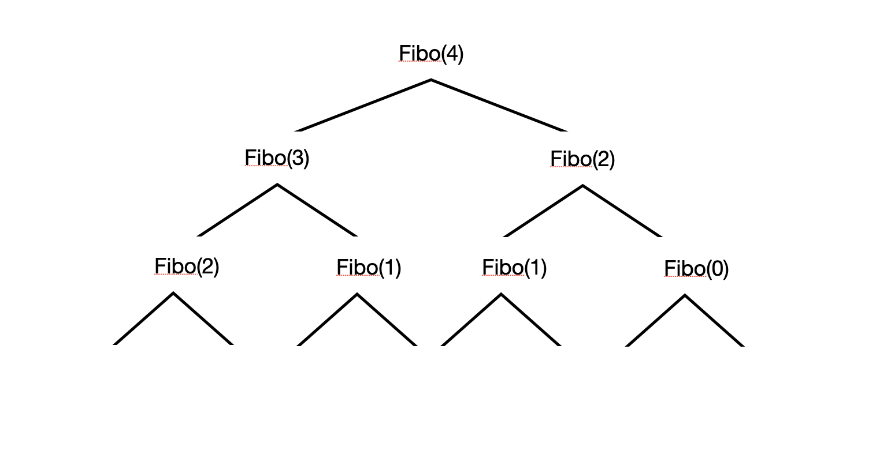
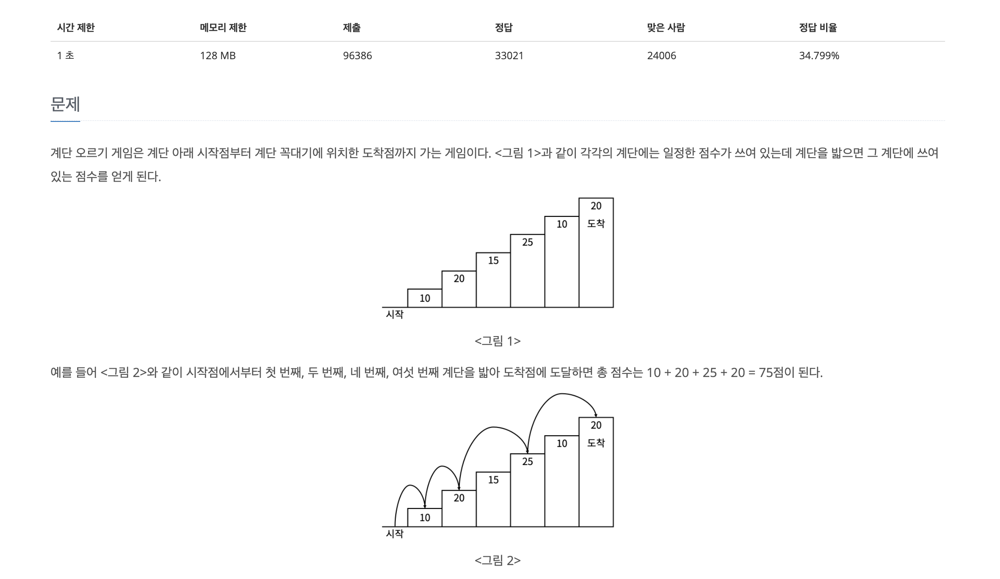
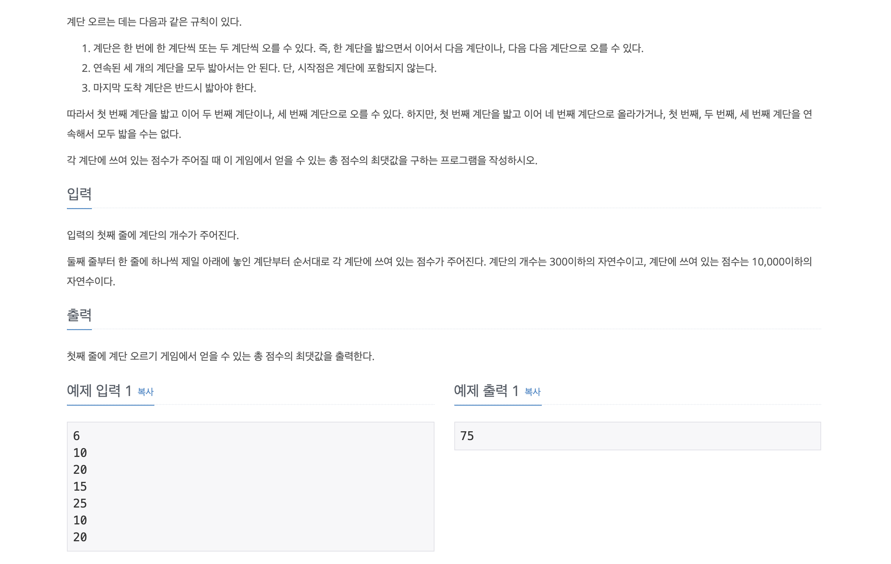

# ▶️ 동적프로그래밍 (Dynamic Programming)

동적 프로그래밍이란, 하나의 문제를 잘게 쪼개며 푸는 방식이다

> 직관적으로 알 수 있을민큼 작게!!

점화식의 측면에서 생각하면 된다 예를 들어 피보나치 수열을 예시로 fibo(0), fibo(1)이 될때까지 잘게 쪼갠다



fibo(1), fibo(0)는 직관적으로 계산이 가능하기 때문에 이 값을 기준으로 Bottom-Up 방식으로 계산한다

같은 fibo들은 계산 값이 같기 때문에 계산을 반복할 필요가 없다

## ▷ 동적 프로그래밍 문제

[백준 2579 - 계단 오르기](https://www.acmicpc.net/problem/2579)





<h3>- 풀이</h3>

```js
const fs = require("fs");
const filePath = process.platform === 'linux' ? '/dev/stdin' : './7_2579.txt';

let input = fs.readFileSync(filePath).toString().trim().split('\n');

const n = parseInt(input[0]);
input.shift();
input = input.map((item) => +item);

// 3개의 계단의 값을 계산에 이용하기 때문에 세개 계단의 값을 미리 구한다
const dy = new Array(n - 1);
dy[0] = input[0];   
dy[1] = input[0]+input[1];
dy[2] = Math.max(input[0]+input[2], input[1]+input[2]);

for (let i = 3; i < n; i++) {
  const way1 = dy[i-3] + input[i-1] + input[i];     // 3개 블록(3개전의 블록합 + 전블록 + 현재블록)
  const way2 = dy[i-2] + input[i];      // 2개 블록 (2개전의 블록합 + 현재블록)
  dy[i] = Math.max(way1, way2);
}
console.log(dy[n-1]);
```

1. 값을 저장할 `dy`라는 배열을 하나 생성한다
2. 초기 계산에 이용할 (0, 1, 2)의 값(idex기준)을 계산해서 넣어준다
3. 계단을 오르는 규칙으로 **3개전의 블록합, 전블록, 현재블록의 점수** / **2개전의 블록합, 현재블록의 점수** 중 큰 값을 구해야 하기 때문에 `Math.max`를 사용한다
4. 마지막 계단의 점수를 출력해주면 된다(dy의 마지막 요소)
