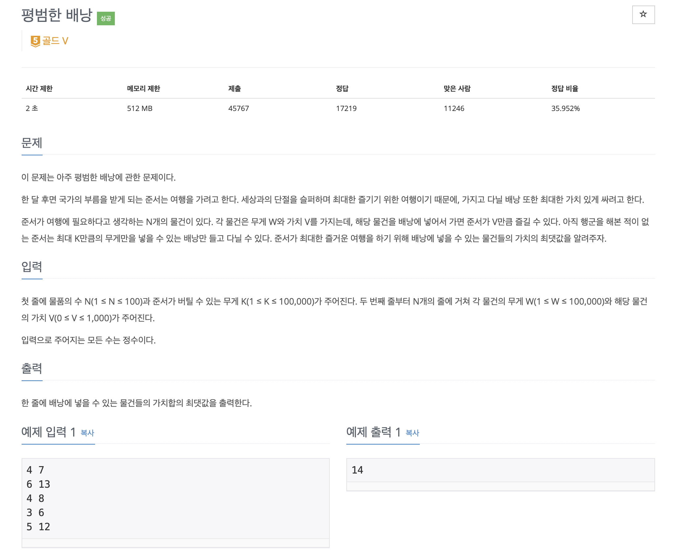

# ▶️ 냅색 알고리즘 (Knapsack)

냅색 알고리즘은 동적 프로그래밍(Dynamic Programming)의 일종으로 여러개의 항목이 있을때 조건에 맞는 조합을 구하는 문제이다

대표적으로 <u>배낭문제</u>가 있다

## ▷ 냅색 알고리즘 문제

[백준 12865 - 평범한 배낭](https://www.acmicpc.net/problem/12865)



```js
const fs = require("fs");
const filePath = process.platform === "linux" ? "/dev/stdin" : "./15_12865.txt";

let input = fs.readFileSync(filePath).toString().trim().split("\n");
const n = parseInt(input[0].split(" ")[0]);
const k = parseInt(input.shift().split(" ")[1]);
input = input.map(item => item.split(" ").map(item2 => +item2));

// 누적 가치를 저장할 배열 dy
const dy = new Array(k+1).fill(0);

// 물건들의 개수만큼 
for(let i = 0; i < n; i++){
  // 중복이 되면 안되기 때문에 뒤에서부터 탐색
  for(let j = k; j >= input[i][0]; j--){
    dy[j] = Math.max(dy[j], dy[j - input[i][0]] + input[i][1]);
  }
}

// dy(누적 가치)중 가장 큰값을 출력
console.log(Math.max(...dy))
```

먼저 동적프로그래밍 문제이므로 누적 가치를 저장해서 다음 계산에 이용할 배열 **dy**를 선언한다

> **dy[i]**: i 무게까지 물건을 담았을때 최대가 되는 가치

1. `dy`를 채우기 위해서 이중 `for`문을 사용한다
2. 바깥의 `for`문은 물건의 개수만큼 반복한다(물건의 무게마다 값을 계산하기 때문에)
3. 내부 `for`문은 현재 i 인덱스(물건의 무게)를 이용해서 `dy`를 계산하게 되는데 이때 거꾸로 계산하게 된다
  - 동적 프로그래밍 문제이므로 앞의 게산값을 이용하게 되는데 만약 앞에서부터 순차적으로 계산을 해주게 되면 중복이 허용된다(물건은 하나씩이므로 두개가 될 수 없음!)
  - 가장 뒤에서 부터 해당 무게(i)까지 계산해준다
4. `dy[j]`는 현재의 `dy[j]`와 <u>현재 무게에서 외부의 for문에서 선택된 물건의 무게를 빼준 항목에 현재 선택된 물건의 가치를 더해준 것</u>과 비교해서 더 가치가 큰 값을 선택한다
5. `for`문이 정상적으로 완료되면 계산할 수 있는 dy들이 모두 채워지고, 이때 가장 큰 값이 가방에 담을 수 있는 가장 큰 가치가 된다!


