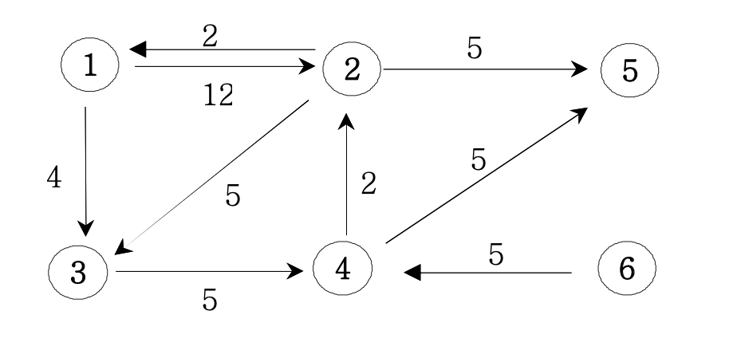
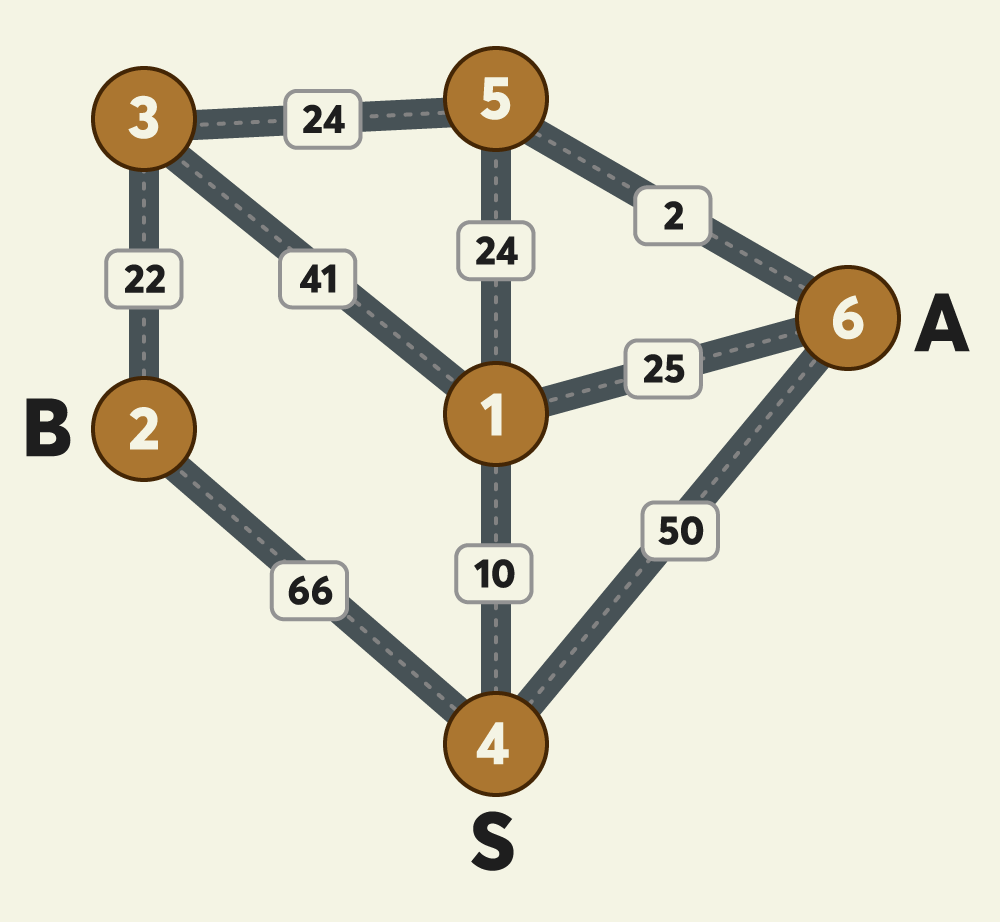

# ▶️ 다익스트라(Dijkstra Algorithm)

다익스트라 알고리즘은 DP(Dynamic Programming)을 활용해서 최단거리를 계산할 수 있는 알고리즘이다

특정한 하나의 정점에서 다른 정점으로 가는 최단 경로를 저장한다

> **출발점이 있고, 어느 정점으로 가야하는 경우에는 다익스트라 알고리즘을 고려해봐야한다!!**




만약 위와 같은 그래프에서 1번 노드에서 2번 노드까지의 최단거리를 구한다면 하나의 간선으로 이루어진 경로(12)로 가는 것보다 3번 4번 노드를 거쳐 가는 경로(11)가 더 최단경로가 된다

최단 경로를 구해야하기 때문에 노드가 많이 존재하는 경우 시간복잡도 logN을 가지는 MinHeap을 이용하기도 한다

```js
class MinHeap{
  constructor() {
    this.heap = [];
    this.heap.push(-1e9);    // 큰 값을 제일 앞에 넣어준다
  }

  // heap에 데이터를 삽입
  insert(a, b){
    this.heap.push([a, b]);
    // 값이 들어오면 작거나 큼에 따라 위로 올려준다
    this.upheap(this.heap.length - 1);
  }


  // insert된 값을 올려주는 메소드
  upheap(pos){
    // 마지막으로 들어온 값을 temp에 할당
    let temp = this.heap[pos];

    // 부모노드와 비교하며 현시점의 부모보다 크면 부모노드의 값을 아래로 내림
    while(temp[1] < this.heap[parseInt(pos/2)][1]){
      this.heap[pos] = this.heap[parseInt(pos/2)];
      pos = parseInt(pos/2);
    }
    // 마지막으로 현시점의 노드에 temp값을 넣어준다
    this.heap[pos] = temp;
  }


  // 루트노드를 가져오는 메소드
  get(){
    // 만약 heap의 크기가 0인데 pop을 하려고 하면 false반환
    if (this.size() === 0) return false;
    // 만약 heap의 크기가 2라면 downheap()을 하지않고 pop만 수행
    if (this.size() === 1) return this.heap.pop();
    // 루트노드값을 result 변수에 임시저장하고, 루트노드 자리에 제일 마지막 노드를 위치시킨다
    const result = this.heap[1];
    this.heap[1] = this.heap.pop();
    // 아래로 진행하면서 자리배치
    this.downheap(1, this.heap.length-1);
    return result;
  }

  downheap(pos, len){
    // 루트노드에 위치한 값을 임시 저장
    let temp = this.heap[pos], child;
    while(pos <= parseInt(len/2)){
      child = pos * 2;        // 왼쪽 자식
      // 자식노드가 하나만 존재할 수 있기 때문에 child < len
      if(child < len && this.heap[child][1] > this.heap[child+1][1]) child++;      // +1로 오른쪽자식과 비교한다 
      // 자식노드보다 크다면 멈춘다
      if(temp[1] <= this.heap[child][1]) break;
      // 자식노드와 부모노드의 자리를 교환
      this.heap[pos] = this.heap[child];
      // 인덱스를 아래로 옮김
      pos = child;
    }
    // 현재 시점의 노드에 값 할당
    this.heap[pos] = temp;
  }

  // heap의 크기를 반환하는 메서드
  size(){
    return this.heap.length-1;
  }
}
```

## ▷ 다익스트라 문제

[프로그래머스 - 배달](https://programmers.co.kr/learn/courses/30/lessons/12978)

### → 문제 설명
> N개의 마을로 이루어진 나라가 있습니다. 이 나라의 각 마을에는 1부터 N까지의 번호가 각각 하나씩 부여되어 있습니다. 각 마을은 양방향으로 통행할 수 있는 도로로 연결되어 있는데, 서로 다른 마을 간에 이동할 때는 이 도로를 지나야 합니다. 도로를 지날 때 걸리는 시간은 도로별로 다릅니다. 현재 1번 마을에 있는 음식점에서 각 마을로 음식 배달을 하려고 합니다. 각 마을로부터 음식 주문을 받으려고 하는데, N개의 마을 중에서 K 시간 이하로 배달이 가능한 마을에서만 주문을 받으려고 합니다. 다음은 N = 5, K = 3인 경우의 예시입니다.


> 위 그림에서 1번 마을에 있는 음식점은 [1, 2, 4, 5] 번 마을까지는 3 이하의 시간에 배달할 수 있습니다. 그러나 3번 마을까지는 3시간 이내로 배달할 수 있는 경로가 없으므로 3번 마을에서는 주문을 받지 않습니다. 따라서 1번 마을에 있는 음식점이 배달 주문을 받을 수 있는 마을은 4개가 됩니다.
마을의 개수 N, 각 마을을 연결하는 도로의 정보 road, 음식 배달이 가능한 시간 K가 매개변수로 주어질 때, 음식 주문을 받을 수 있는 마을의 개수를 return 하도록 solution 함수를 완성해주세요.

### → 제한사항
> - 마을의 개수 N은 1 이상 50 이하의 자연수입니다.
- road의 길이(도로 정보의 개수)는 1 이상 2,000 이하입니다.
- road의 각 원소는 마을을 연결하고 있는 각 도로의 정보를 나타냅니다.
- road는 길이가 3인 배열이며, 순서대로 (a, b, c)를 나타냅니다.
- a, b(1 ≤ a, b ≤ N, a != b)는 도로가 연결하는 두 마을의 번호이며, c(1 ≤ c ≤ 10,000, c는 자연수)는 도로를 지나는데 걸리는 시간입니다.
- 두 마을 a, b를 연결하는 도로는 여러 개가 있을 수 있습니다.
- 한 도로의 정보가 여러 번 중복해서 주어지지 않습니다.
- K는 음식 배달이 가능한 시간을 나타내며, 1 이상 500,000 이하입니다.
- 임의의 두 마을간에 항상 이동 가능한 경로가 존재합니다.
- 1번 마을에 있는 음식점이 K 이하의 시간에 배달이 가능한 마을의 개수를 return 하면 됩니다.

### → 입출력 예

| N | road | K | result |
|:---:|:---|:---:|:---:|
| 5 | [[1,2,1],[2,3,3],[5,2,2],[1,4,2],[5,3,1],[5,4,2]] | 3 | 4 |
| 6 | [[1,2,1],[1,3,2],[2,3,2],[3,4,3],[3,5,2],[3,5,3],[5,6,1]] | 4 | 4 |


### → 풀이
```js
class minHeap{
  constructor(){
    this.heap=[];
    this.heap.push([Number.MIN_SAFE_INTEGER, 0]);
  }
  insert([a, b]){
    this.heap.push([a, b]);
    this.upheap(this.heap.length-1);
  }
  upheap(pos){
    let tmp=this.heap[pos];
    while(tmp[1]<this.heap[parseInt(pos/2)][1]){
      this.heap[pos]=this.heap[parseInt(pos/2)];
      pos=parseInt(pos/2);
    }
    this.heap[pos]=tmp;
  }
  get(){
    if(this.heap.length===2){
      return this.heap.pop();
    }
    let res;
    res=this.heap[1];
    this.heap[1]=this.heap.pop();
    this.downheap(1, this.heap.length-1);
    return res;
  }
  downheap(pos, len){
    let tmp, i;
    tmp=this.heap[pos];
    while(pos<=parseInt(len/2)){
      i=pos*2;
      if(i<len && this.heap[i][1]<this.heap[i+1][1]) i++;
      if(tmp[1]<=this.heap[i][1]) break;
      this.heap[pos]=this.heap[i];
      pos=i;
    }
    this.heap[pos]=tmp;
  }
  size(){
    return this.heap.length-1;
  }
  top(){
    return this.heap[1];
  }
}

function solution(N, road, K) {
  let answer = 0;
  // MinHeap을 사용
  let heap = new minHeap();
  
  // 입력을 graph화할 이차원 배열 생성
  let graph = Array.from(Array(N+1), () => Array());
  
  // 각 노드를 기준으로 최단거리를 저장할 배열
  let dist = Array.from({length:N+1}, () => 700000);

  // 입력을 인접리스트형태로 변환
  for(let [a, b, c] of road){
    graph[a].push([b, c]);
    graph[b].push([a, c]);
  }

  // 초기값 (첫번째 노드로 가는 비용은 0)
  dist[1] = 0;    
  heap.insert([1, 0]);  

  while(heap.size() > 0){
    let tmp = heap.get();
    let now = tmp[0];
    let nowCost = tmp[1];

    // 만약 현재 구한값(minheap에 있던값)이 더 작으면 아래 코드를 진행하지 않도록
    if(nowCost > dist[now]) continue;

    for(let [next, cost] of graph[now]){
      // 계산한 값 (MinHeap에 있던 값)이 더 작으면 갱신
      if(nowCost + cost < dist[next]){
        dist[next] = nowCost + cost;
        // 다음 계산을 위해 heap에 넣어줌
        heap.insert([next, dist[next]]);
      }
    }
  }

  // K를 넘는 값을 카운팅
  for(const d of dist){
    if(d <= K) answer++;
  }
  return answer;
}
```

자동으로 최소값을 루트노드로 올려주는 MinHeap을 이용해서 하나씩 추출하고, 그 값을 최단거리를 저장하는 `dist` 배열의 값과 비교하면서 계속해서 **최단거리를 갱신해준다**


<br>


# ▶️ 플로이드 워셜(Floyd-Warshall)

다익스트라 알고리즘과 비슷한 개념이지만 차이점이 존재한다

다익스트라는 <u>하나의 정점에서 모든 노드까지의 최단거리를 계산하지만</u> <u>플로이드 워셜은 모든 정점에서 모든 노드까지의 최단거리를 계산한다</u>

모든 노드를 탐색하면서 그 과정에서 최단거리를 저장하는 DP테이블의 값보다 작은 값이 존재한다면 갱신시켜준다

## ▷ 플로이드 워셜 문제

[프로그래머스 - 합승 택시 요금](https://programmers.co.kr/learn/courses/30/lessons/72413)

### → 문제 설명
> [본 문제는 정확성과 효율성 테스트 각각 점수가 있는 문제입니다.]
밤늦게 귀가할 때 안전을 위해 항상 택시를 이용하던 무지는 최근 야근이 잦아져 택시를 더 많이 이용하게 되어 택시비를 아낄 수 있는 방법을 고민하고 있습니다. "무지"는 자신이 택시를 이용할 때 동료인 어피치 역시 자신과 비슷한 방향으로 가는 택시를 종종 이용하는 것을 알게 되었습니다. "무지"는 "어피치"와 귀가 방향이 비슷하여 택시 합승을 적절히 이용하면 택시요금을 얼마나 아낄 수 있을 지 계산해 보고 "어피치"에게 합승을 제안해 보려고 합니다.



> 위 예시 그림은 택시가 이동 가능한 반경에 있는 6개 지점 사이의 이동 가능한 택시노선과 예상요금을 보여주고 있습니다.
그림에서 A와 B 두 사람은 출발지점인 4번 지점에서 출발해서 택시를 타고 귀가하려고 합니다. A의 집은 6번 지점에 있으며 B의 집은 2번 지점에 있고 두 사람이 모두 귀가하는 데 소요되는 예상 최저 택시요금이 얼마인 지 계산하려고 합니다.

>그림의 원은 지점을 나타내며 원 안의 숫자는 지점 번호를 나타냅니다.
지점이 n개일 때, 지점 번호는 1부터 n까지 사용됩니다.
지점 간에 택시가 이동할 수 있는 경로를 간선이라 하며, 간선에 표시된 숫자는 두 지점 사이의 예상 택시요금을 나타냅니다.
간선은 편의 상 직선으로 표시되어 있습니다.
위 그림 예시에서, 4번 지점에서 1번 지점으로(4→1) 가거나, 1번 지점에서 4번 지점으로(1→4) 갈 때 예상 택시요금은 10원으로 동일하며 이동 방향에 따라 달라지지 않습니다.
예상되는 최저 택시요금은 다음과 같이 계산됩니다.
4→1→5 : A, B가 합승하여 택시를 이용합니다. 예상 택시요금은 10 + 24 = 34원 입니다.
5→6 : A가 혼자 택시를 이용합니다. 예상 택시요금은 2원 입니다.
5→3→2 : B가 혼자 택시를 이용합니다. 예상 택시요금은 24 + 22 = 46원 입니다.
A, B 모두 귀가 완료까지 예상되는 최저 택시요금은 34 + 2 + 46 = 82원 입니다.

### → 문제
>지점의 개수 n, 출발지점을 나타내는 s, A의 도착지점을 나타내는 a, B의 도착지점을 나타내는 b, 지점 사이의 예상 택시요금을 나타내는 fares가 매개변수로 주어집니다. 이때, A, B 두 사람이 s에서 출발해서 각각의 도착 지점까지 택시를 타고 간다고 가정할 때, 최저 예상 택시요금을 계산해서 return 하도록 solution 함수를 완성해 주세요.
만약, 아예 합승을 하지 않고 각자 이동하는 경우의 예상 택시요금이 더 낮다면, 합승을 하지 않아도 됩니다.

### → 제한사항
- 지점갯수 n은 3 이상 200 이하인 자연수입니다.
- 지점 s, a, b는 1 이상 n 이하인 자연수이며, 각기 서로 다른 값입니다.
- 즉, 출발지점, A의 도착지점, B의 도착지점은 서로 겹치지 않습니다.
- fares는 2차원 정수 배열입니다.
- fares 배열의 크기는 2 이상 n x (n-1) / 2 이하입니다.
- 예를들어, n = 6이라면 fares 배열의 크기는 2 이상 15 이하입니다. (6 x 5 / 2 = 15)
- fares 배열의 각 행은 [c, d, f] 형태입니다.
- c지점과 d지점 사이의 예상 택시요금이 f원이라는 뜻입니다.
- 지점 c, d는 1 이상 n 이하인 자연수이며, 각기 서로 다른 값입니다.
- 요금 f는 1 이상 100,000 이하인 자연수입니다.
- fares 배열에 두 지점 간 예상 택시요금은 1개만 주어집니다. 즉, [c, d, f]가 있다면 [d, c, f]는 주어지지 않습니다.
- 출발지점 s에서 도착지점 a와 b로 가는 경로가 존재하는 경우만 입력으로 주어집니다.

### → 입출력 예

| n	| s	| a	| b	| fares	| result |
|:---:|:---:|:---:|:---:|:---|:---:|
| 6	|	4	|	6	|	2	|	[[4, 1, 10], [3, 5, 24], [5, 6, 2], [3, 1, 41], [5, 1, 24], [4, 6, 50], [2, 4, 66], [2, 3, 22], [1, 6, 25]]	|	82 |
| 7	|	3	|	4	|	1	|	[[5, 7, 9], [4, 6, 4], [3, 6, 1], [3, 2, 3], [2, 1, 6]]	|	14 |
| 6	|	4	|	5	|	6	|	[[2,6,6], [6,3,7], [4,6,7], [6,5,11], [2,5,12], [5,3,20], [2,4,8], [4,3,9]]	|	18 |

### → 풀이
```js
function solution(n, s, a, b, fares) {
  // 최소값을 구해주기 위해서 큰값을 초기값으로 할당
  var answer = 10e9;
  
  // dy[i][j] = i에서 j로 가는 택시요금
  const dy = new Array(n + 1);
  for(let i = 0; i < n + 1; i++){
    dy[i] = new Array(n + 1).fill(10e9);
  }

  // i = j이면 0으로 초기화
  for(let i = 0; i <= n; i++)dy[i][i] = 0;

  // 입력을 dy에 반영
  for(const [a, b, c] of fares){
    dy[a][b] = c;
    dy[b][a] = c;
  }

  // 삼중 for문을 사용해서 모든 노드를 탐색한다
  for(let k = 1; k < n + 1; k++){
    for(let i = 1; i < n + 1; i++){
      for(let j = 1; j < n + 1; j++){
        // 만약 dy[i][j]보다 중간에 거쳐가는 노드(k)가 있는 경우가 더 작다면 갱신
        if(dy[i][j] > dy[i][k] + dy[k][j]){
          dy[i][j] = (dy[i][k] + dy[k][j]);
        }
      }
    }
  }

  // 가장 적은 합승요금을 반환하기 위한 반복문
  for(let i = 1; i <= n; i++){
    // dy[s][i] = 출발점 s지점에서, i까지 가는 비용(합승)
    // dy[i][a] = i지점에서, i에서 a까지 가는 비용
    // dy[i][b] = i지점에서, i에서 b까지 가는 비용
    answer = Math.min(answer, dy[s][i] + dy[i][a] + dy[i][b]);
  }
  return answer;
}
```

**삼중 `for`문과 이차원 배열(`dy[i][j]` = i에서 j로 가는 최단거리)을 이용해서 최단거리를 구해준다**
